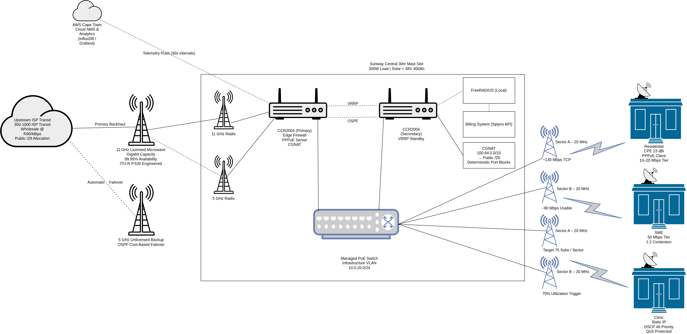
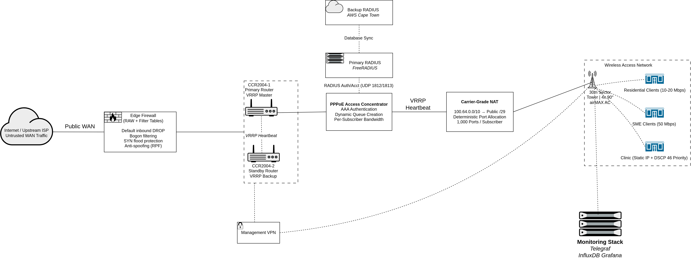

# WISP Network Automation & Infrastructure Architecture Lab

This repository demonstrates the design and automation of a **small-scale Wireless Internet Service Provider (WISP)** deployment.

## Architecture Overview






The project was built as part of a technical architecture exercise exploring how modern network infrastructure can combine **wireless access networks, subscriber authentication, automation workflows, and operational telemetry**.

The objective of this lab is to simulate the type of infrastructure engineering challenges faced by **rural broadband providers and small ISPs**, while demonstrating practical skills in:

- Network architecture design
- Wireless access planning
- Subscriber management
- Infrastructure automation
- Operational monitoring


# Architecture Overview

The proposed deployment models a **village-scale broadband network** designed to deliver reliable wireless internet access to residential and SME customers.

The architecture includes:

- High-availability **core router cluster (VRRP)**
- **Carrier Grade NAT (CGNAT)** for IPv4 conservation
- **PPPoE subscriber authentication and management**
- **RADIUS-based AAA infrastructure**
- Sectorized **5GHz point-to-multipoint wireless access network**
- Segmented **VLAN architecture** for traffic isolation
- Monitoring stack using **Telegraf, InfluxDB, and Grafana**

The design emphasizes **scalability, operational visibility, and service reliability**.


# Repository Structure
```
wisp-network-automation-lab
│
├── architecture
│   └── Sunway_Village_WISP_Architecture.pdf
│
├── automation
│   └── mikrotik_pppoe_provisioning.py
│
├── diagrams
│   ├── security-traffic-flow.png
│   ├── vlan-segmentation.png
│   ├── network-topology.png
│   └── coverage-map.png
│
└── docs
    └── automation-workflow.md
```


# Network Architecture Highlights

## High Availability Routing

Two MikroTik CCR routers operate in a **VRRP cluster** to ensure service continuity.  
If the primary router fails, the standby router automatically assumes gateway responsibilities.

This prevents a single device failure from disrupting subscriber connectivity.


## Carrier Grade NAT (CGNAT)

To address IPv4 scarcity, the network implements **CGNAT** using the shared address space:

```
100.64.0.0/10
```

Deterministic port allocation is used to maintain consistent NAT mapping behavior and simplify troubleshooting.


## PPPoE Subscriber Management

Subscriber authentication and bandwidth enforcement are handled using **PPPoE sessions tied to RouterOS profiles**.

Each subscriber receives:

- a dedicated PPPoE login
- a service tier profile
- dynamic bandwidth shaping
- traffic monitoring

Example service tiers include:

| Service Tier | Speed |
|---------------|-------|
| 10Mbps_Residential | Entry level |
| 20Mbps_Residential | Standard residential |
| 50Mbps_SME | Dedicated business tier |


# Network Automation Component

A Python automation script demonstrates how **subscriber provisioning can be automated using the MikroTik RouterOS REST API**.

The script implements a provisioning workflow triggered by an installation event.

Key automation features include:

- secure credential handling via environment variables
- REST API interaction with RouterOS v7
- retry logic for transient network failures
- structured logging for operational auditing
- validation of service tiers before provisioning

Example provisioning call:

```python
provision_pppoe_subscriber(
    username="sunway_house_402",
    password="AutoGeneratedAuthKey",
    service_tier="20Mbps_Residential"
)
```

# Monitoring & Observability

**Operational visibility is achieved using a lightweight monitoring stack:**

*Telegraf*
- collects SNMP telemetry from routers and wireless devices

*InfluxDB*
- stores time-series performance metrics

*Grafana*
- provides dashboards for network health monitoring

*Example metrics monitored:*
- interface utilization
- wireless sector capacity
- subscriber session counts
- CPU and memory utilization
- packet loss and latency

# Security Considerations
**The architecture incorporates several defensive mechanisms:**
- Edge firewall filtering and bogon network blocking
- SYN flood protection and anti-spoofing rules
- Network segmentation using VLANs
- Secure management access through VPN tunnels
- Authentication via RADIUS infrastructure

These controls help ensure that the network maintains a *secure operational baseline* while still supporting automated provisioning workflows.

# Automation Workflow
A simplified automation pipeline demonstrates how new customers could be provisioned automatically.
*The workflow is documented in:*
[Automation Workflow Documentation](docs/automation-workflow.md)
This model simulates how ISP installation platforms such as UISP or OSS/BSS systems can trigger provisioning events.

# Running the Automation Script

## Set the required environment variables:
```bash
export MIKROTIK_IP=10.255.0.1
export API_USER=api_provisioner
export API_PASS=your_secure_password
```

## Run the provisioning script:
```bash
python automation/mikrotik_pppoe_provisioning.py
```

*The script will attempt to create a PPPoE subscriber on the configured RouterOS device using the REST API.*

# Technologies Used

*Network Infrastructure*
- MikroTik RouterOS v7
- PPPoE Access Concentrator
- VRRP High Availability
- VLAN segmentation
- Carrier Grade NAT

*Automation*
- Python
- REST APIs
- Environment-based credential management

*Monitoring*
- Telegraf
- InfluxDB
- Grafana


# Future Directions

This repository documents a completed network infrastructure lab.
 
The following extensions are planned for future iterations:

**Network Security Enhancements**
- automated firewall policy deployment
- anomaly detection using traffic metrics
- integration with network IDS systems

**Infrastructure as Code**
- automated router configuration using Ansible
- repeatable infrastructure deployments

**Network Telemetry Expansion**
- streaming telemetry
- Prometheus-based monitoring pipelines
- real-time alerting systems

**Advanced Network Automation**
- automated capacity scaling
- automated service provisioning pipelines
- integration with external OSS/BSS systems

**Security Research Direction**
This lab is one component of a broader research trajectory. Active research 
into kernel-level security is currently underway — see 
[sentinel-ebpf](https://github.com/Murashidzi/sentinel-ebpf) for the 
implementation of eBPF-based container runtime threat detection.


# About

This lab demonstrates applied network infrastructure engineering across three 
layers simultaneously: physical wireless access network design, subscriber 
authentication and management, and operational telemetry.

The network telemetry patterns implemented here — SNMP collection via Telegraf, 
time-series storage in InfluxDB, threshold-based alerting in Grafana — directly 
inform the observability architecture in my eBPF container security research, 
where the same principle applies: you cannot detect what you cannot measure.

The security baseline implemented in this lab (edge filtering, SYN flood 
protection, RADIUS authentication, VLAN segmentation) reflects the same 
defence-in-depth philosophy applied at the cloud layer in the 
[Zero Trust Banking Platform](https://github.com/Murashidzi/zero-trust-banking-platform) 
and at the kernel layer in [sentinel-ebpf](https://github.com/Murashidzi/sentinel-ebpf) 
(in development).
